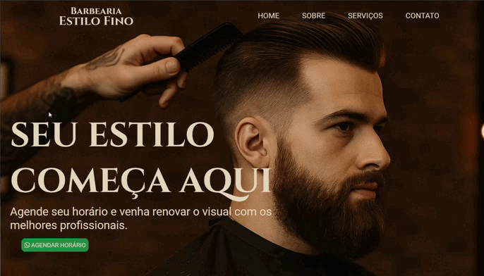

<h1>💈 Barbearia Estilo Fino</h1>

Projeto desenvolvido para uma barbearia moderna e sofisticada, com foco em um visual elegante e responsivo.

A página inicial apresenta um banner em tela cheia, com uma imagem de fundo que cobre todo o espaço de forma proporcional, destacando o slogan da marca e um botão interativo para agendamento de horário.

O menu de navegação é transparente e muda de cor ao rolar a página, garantindo uma experiência fluida e agradável ao usuário.

<h2>✨ Principais recursos</h2>

    Layout totalmente responsivo

    Banner com imagem de fundo ajustável

    Navbar transparente com efeito de cor ao rolar

    Botão com animação de zoom no hover

    ipografia elegante e contraste visual refinado

    Integração com WhatsApp para agendamento rápido

<h2>🧠 Tecnologias utilizadas</h2>

    HTML5

    CSS3

    JavaScript

